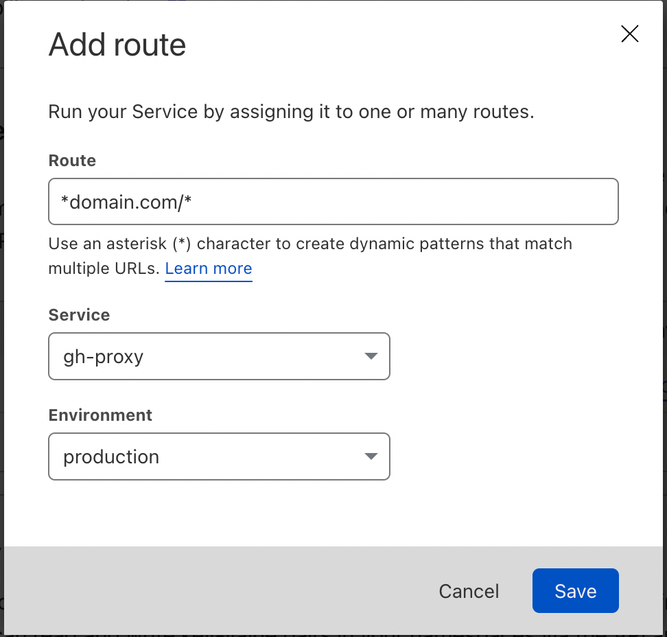
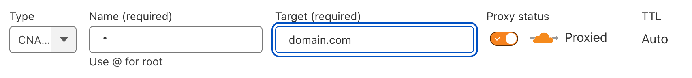

Cloudflare Worker ⚡ `gh-proxy`
===

Set up a (sub)-domain proxy for Github Pages.

This worker creates a proxy that works like this:

- `domain.com` → `username.github.io`
- `domain.com/project/` → `username.github.io/project/`
- `project.domain.com` → `username.github.io/project/`

**ℹ️ This is NOT a URL redirection.** It really proxies and hides the original `username.github.io`.

Pre-requisites
---

You'll need a [Cloudflare Workers account](https://dash.cloudflare.com/sign-up/workers) with:

- A workers domain set up
- Some GitHub-Pages hosted web pages

Prepare the following secrets:

- `CF_API_TOKEN`: Cloudflare API token with `Edit Cloudflare Workers` permissions
- `CF_ACCOUNT_ID`: Cloudflare account ID

Getting started
---

1. Clone/fork this repository.
2. Edit `wrangler.toml`. Change the `ROOT_GH` variable.
3. Install dependencies by running `npm i`.
4. Test it locally by running `npm start`.
5. Set up the secrets mentioned above if using GitHub Actions to deploy.
6. Publish by running `npm run publish`.

Further steps
---

Go to your Cloudflare dashboard, click on a web site, click to `Workers`, press `Add route`.

Add your domain to the `Route` field. Two options:

1. `domain.com/*`: if you only want to proxy the sub-directories
2. `*domain.com/*`: if you want to proxy the sub-domains *and* sub-directories

For the wildcard subdomains to work, click to `DNS`, and press `Add record`.

Choose `CNAME`, use `*` as `Name` and set the `Target` to your domain.

Response Headers
---

Two extra headers are set:

- `x-original-url`: The original URL that's requested
- `x-destination-url`: The URL that's proxied

They are useful for debugging purposes.

Demo
---

[steepless.cheeaun.dev](https://steepless.cheeaun.dev) → [cheeaun.github.io/steepless/](https://cheeaun.github.io/steepless/)
